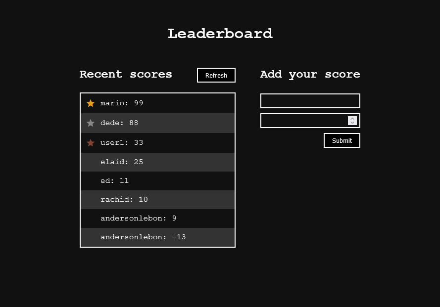

# Webpack Boilerplate

This is a leaderboard app to displays scores submitted by different players. All data is preserved thanks to the external leaderboard API.



## Built using

- HTML
- CSS
- JavaScript
- Webpack

## Usage

start by cloning this repository by running:

```
git clone https://github.com/rachidelaid/Leaderboard.git
```

cd to the folder

```
cd Leaderboard
```

run this command to install all the packages needed

```
npm install
```

to run a live server on port 8080 run this command

```
npm run start
```

to build your project run:

```
npm run build
```

## Authors

👤 **Rachid El aid**

- GitHub: [@rachidelaid](https://github.com/rachidelaid)
- Twitter: [@rachidelaid1](https://twitter.com/rachidelaid1)
- LinkedIn: [rachid elaid](https://www.linkedin.com/in/rachid-elaid-106336203/)

## Show your support

Give a ⭐️ if you like this project!
